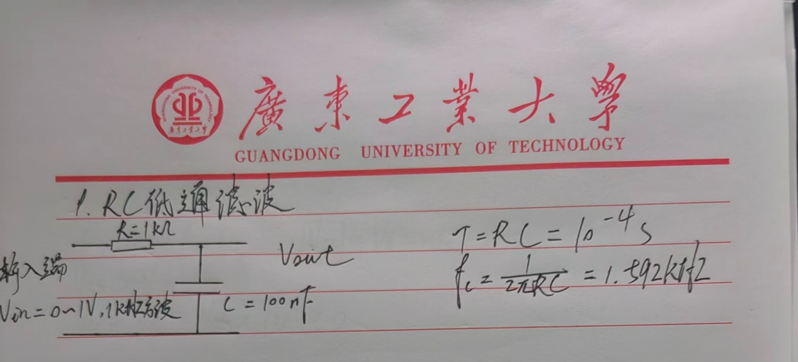
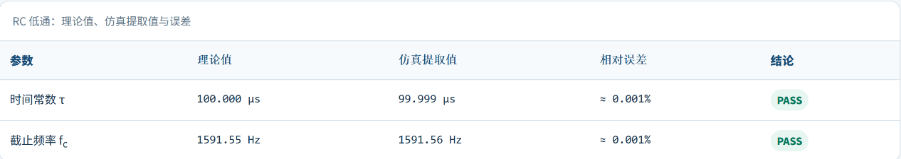
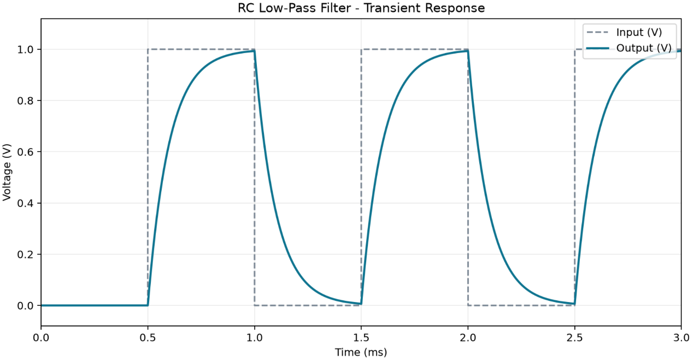
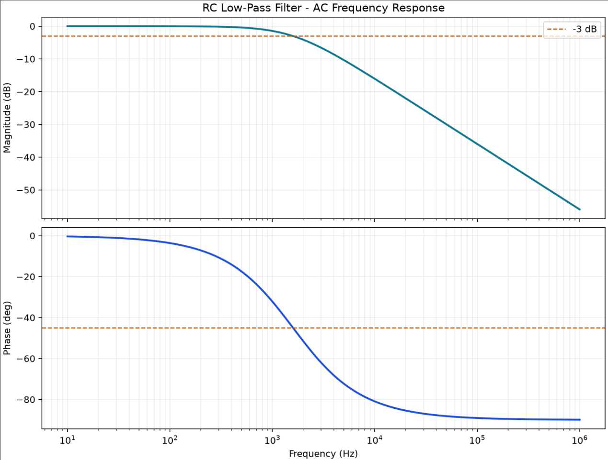
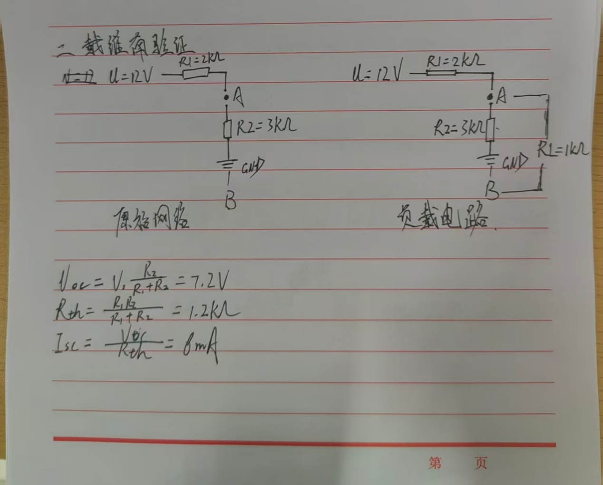
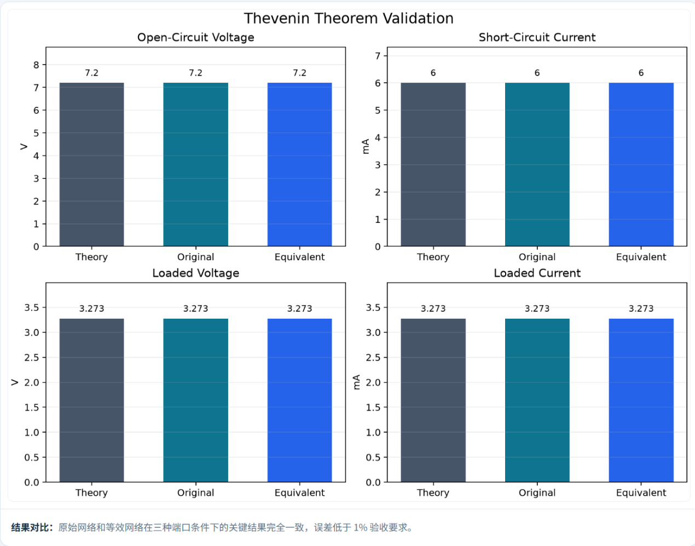
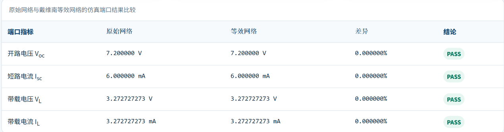
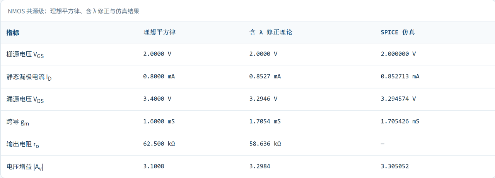
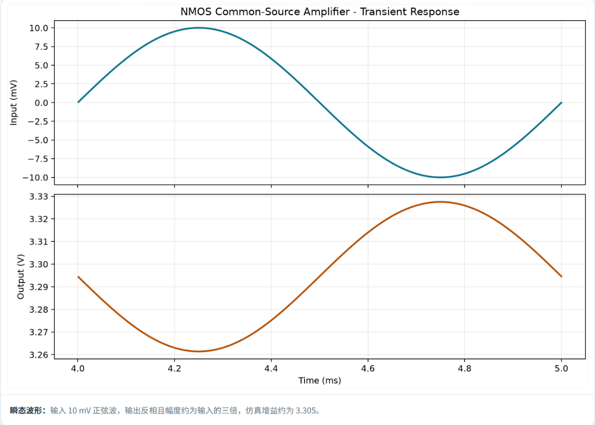
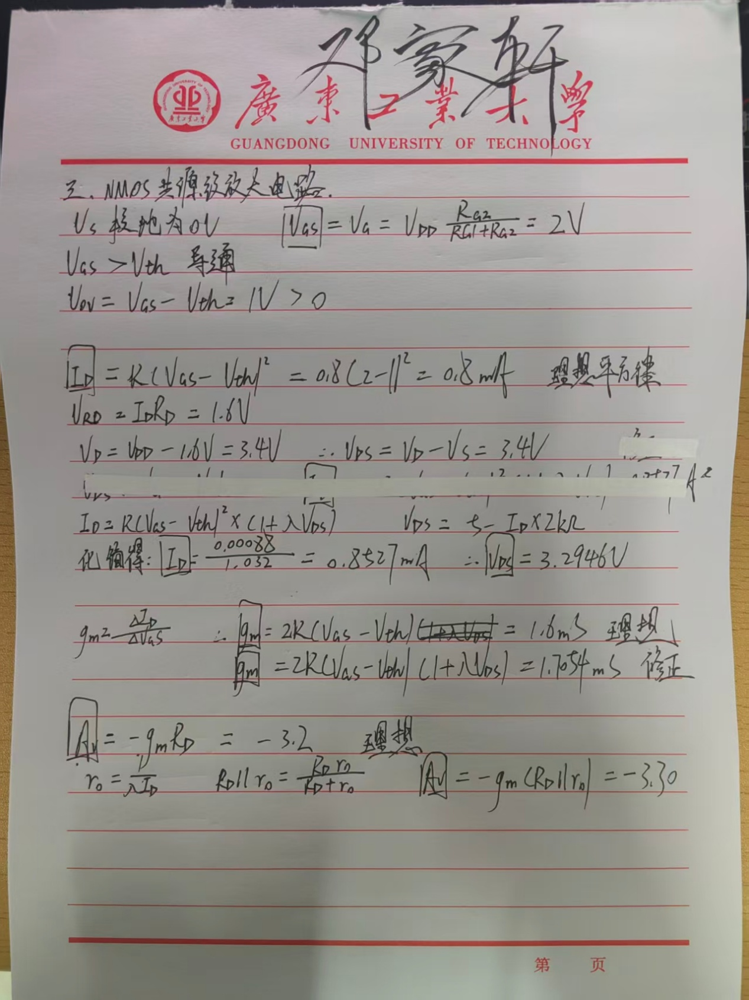

# New-Recruit-Test
> 广东工业大学集成电路专业大一招新考核项目

>

> 作者：邓家轩（TarnishDawned）  

> GitHub：<https://github.com/TarnishDawned>  

> 主仓库：<https://github.com/TarnishDawned/New-Recruit-Test>  

> 个人主页：<https://tarnishdawned.github.io/New-Recruit-Test/>

本仓库用于提交“大一招新考核”的完整作品，包含个人简介、个人网站、2048 两阶段小游戏以及 PySpice 三个电路仿真实验。

## 关于分支与合并

在原有开发路线上可分支另一条路线，在此路线上的修改不会影响原路线，当分支路线开发成熟，可通过合并操作将其并入原路线继续主干开发。

## 关于LICENSE

这次选择MIT License，主要是因为这是一种比较宽松的开源许可证，它允许别人对作者的代码进行查看，使用，修改，复制，再发布等操作，同时它不要求使用者必须把自己修改后的代码继续以MIT开源。此项目作为社团招新考核项目，要能做到开源，方便别人查看，运行以及修改，因此选择比较宽松的 MIT License。

## 关于AI信息查证

在使用 AI 辅助配置 PySpice 环境时，AI 给出的建议让我判断：在安装 PySpice、配置 ngspice DLL，并通过安装检查后，PySpice 环境基本就可以正常使用。我先后用python检测pyspice安装与检查ngspice确认环境正常。但我实际运行时出现报错，查证后发现高版本python与pyspice存在一定的兼容性问题，而AI没有考虑到这一点，后续下载较低版本解决问题。

## 关于AI生成代码关键

关于2048中的合并逻辑：对于[2,2,2,2]进行移动，结果理应得到[0,0,4,4]并非[0,0,0,8]。实际上对于后一种结果，它对初始状态进行了两项操作，而这与用户的单次移动是矛盾的。因此对于单次操作，每个方块最多参与一次合并，这是基本准则。对于一次移动操作，先对空白地方去除，然后依据准则对相邻相同数字进行合并，在最后补上空白，实现一次合并操作。

关于2048中的胜利技巧：想把棋盘上的数字做大，必须让棋盘上的数字方块保持从大到小的顺序，最大的方块呆在一个角落。因此在AI游玩的过程中，必须时刻注意棋盘上的数字分布，让其能大概保持这种单调性，权衡各个方向的合理性，进行合成优先级的权重配比。

## 关于Prompt

阶段一：我先用chatgpt阐明我的需求：（我想做一个2048游戏，请你帮我规划制作方案并设计完整可提供至codex的提示词。）在AI初步设计好时，我就页面现有功能进行人工验证，查看其是否能正常运行，检查有无bug或偏离预期的功能设计。最后把这份文件发送给AI，让它再次依据文件考核指标进行二次验证。

阶段二：我让chatgpt阅读考核文件：（请阅读这份文件，根据其要求给我一段prompt，要求符合文件中的要求，并且在完成后进行自我验证）。同样，在游戏网站设计好后，我自己进行游玩，确保各个功能符合预期设计，然后交给AI进行二次验证。

## 关于PySpice 进阶挑战

首先，我制作了一个网站以存放AI生成的结果，这个网站也可通过我的个人主页链接进入，下面是网址：

https://tarnishdawned.github.io/New-Recruit-Test/pyspice/index.html#main

以下是我自己的手绘图以及手算过程：

### RC低通滤波

### 戴维南验证

### MOS共源放大器

